# Подготовка к экзамену по фундаментальным алгоритмам

### 1. Платформа .NET. CLR (Common Language Runtime) и JIT-компиляция. Процесс компиляции в C#.

.NET - это платформа для разработки и выполнения программ. В нее входят языки, стандартные библиотеки, компилятор, среда выполнения и инструменты. Программа на C# обычно компилируется не сразу в машинный код, а в промежуточный код IL/CIL и метаданные. Метаданные описывают типы, методы, поля, свойства, интерфейсы и зависимости сборки.

CLR, или Common Language Runtime, - это среда выполнения .NET. Она загружает сборки `.exe` или `.dll`, проверяет код и метаданные, управляет памятью, исключениями, типовой безопасностью и выполнением программы.

Процесс компиляции выглядит так: исходный код C# проверяется компилятором, затем создается сборка с IL и метаданными. При запуске CLR загружает сборку, а JIT-компилятор переводит IL нужных методов в машинный код. JIT означает Just-In-Time: метод обычно компилируется при первом вызове, а затем уже используется готовый машинный код.

Такой подход дает переносимость и позволяет CLR оптимизировать код под конкретную среду выполнения. Минус в том, что первый вызов метода может быть чуть медленнее из-за JIT-компиляции.

### 2. Управление памятью в .NET. Стек (Stack) vs Куча (Heap). Различия ссылочных типов и значимых типов. Понятие Boxing/Unboxing и их влияние на производительность.

В .NET память обычно делят на стек и управляемую кучу. Стек хранит данные, связанные с вызовами методов: параметры, локальные переменные, адрес возврата. При вызове метода создается стековый кадр, а при завершении метода он быстро удаляется.

Куча нужна для объектов, которые могут жить дольше одного вызова метода. Объекты, созданные через `new`, обычно попадают в управляемую кучу. Пока на объект есть достижимые ссылки, он считается живым. Когда ссылок больше нет, память позже освобождает сборщик мусора.

Значимые типы (`int`, `double`, `bool`, `struct`) хранят само значение и при присваивании обычно копируются целиком. Ссылочные типы (`class`, `string`, массивы, делегаты) хранят ссылку на объект в куче, поэтому при присваивании копируется ссылка. Важно: значимый тип не всегда лежит в стеке. Например, поле значимого типа внутри объекта лежит вместе с объектом в куче.

Boxing - это упаковка значимого типа в объект, например присваивание `int` переменной типа `object`. При этом создается объект в куче и туда копируется значение. Unboxing - извлечение значения обратно. Boxing ухудшает производительность: появляются лишние выделения памяти, копирование и нагрузка на GC. Поэтому вместо `object` часто используют generics, например `List<int>`.

### 3. Сборка мусора (Garbage Collector). Поколения объектов, фазы работы GC.

Garbage Collector, или GC, автоматически освобождает память от объектов, которые больше недоступны программе. Объект считается живым, если до него можно добраться из корней: локальных переменных активных методов, статических полей, регистров и внутренних структур CLR.

Упрощенно GC работает в несколько фаз. Сначала он идет от корней и помечает все достижимые объекты. Затем объекты без отметки считаются мусором. После этого память освобождается, а живые объекты в компактируемых областях могут быть сдвинуты ближе друг к другу, чтобы уменьшить фрагментацию. Если объект переместился, CLR обновляет ссылки на него.

Куча в .NET делится на поколения. Новые небольшие объекты попадают в поколение 0. Если объект пережил сборку, он может перейти в поколение 1, а потом в поколение 2. Поколение 0 собирается чаще, потому что многие временные объекты быстро становятся мусором. Поколение 2 содержит долгоживущие объекты и собирается реже.

GC освобождает управляемую память, но не заменяет аккуратную работу с ресурсами. Если программа хранит ссылки на ненужные объекты, GC их не удалит. Файлы, сетевые соединения и другие внешние ресурсы обычно закрывают через `IDisposable` и `using`.

### 4. Generics в C#. Механизм реализации дженериков в CLR. Ковариантность и контравариантность.

Generics позволяют писать типы и методы с параметрами типов. Например, `List<T>` можно использовать как `List<int>`, `List<string>` или `List<Person>`. Главные плюсы: типобезопасность и отсутствие лишнего boxing. В `List<int>` нельзя случайно положить строку, а числа не упаковываются в `object`.

В CLR generics реализованы не как простая текстовая подстановка. Информация о параметрах типов хранится в метаданных и известна среде выполнения. Для ссылочных типов CLR может переиспользовать один вариант машинного кода, потому что ссылки устроены одинаково. Для значимых типов обычно создается специализированный код, чтобы хранить значения без упаковки.

У generics могут быть ограничения: `where T : class`, `where T : struct`, `where T : new()`, наследование от класса или реализация интерфейса. Они нужны, чтобы компилятор знал, какие операции разрешены для `T`.

Ковариантность означает, что более конкретный тип можно использовать там, где ожидается более общий: `IEnumerable<string>` можно передать как `IEnumerable<object>`. В C# это обозначается `out`, потому что тип только "выдается" наружу. Контравариантность работает наоборот для входных параметров: например, обработчик `object` можно использовать там, где нужен обработчик `string`. Она обозначается `in`. Вариантность поддерживается в основном для интерфейсов и делегатов, а не для классов вроде `List<T>`.

### 5. Объектно-ориентированное программирование на C#. Классы. Инкапсуляция. Наследование. Статический и динамический полиморфизм. Перегрузка методов и операторов.

Класс в C# описывает тип объектов: их данные и поведение. Данные задаются полями и свойствами, поведение - методами, конструкторами и операторами. Объект - это экземпляр класса.

Инкапсуляция означает, что внутреннее состояние объекта скрывается, а доступ к нему идет через понятный интерфейс. Для этого используются `private`, `public`, `protected`, `internal`. Обычно поля делают закрытыми, а наружу дают свойства и методы. Так класс сам контролирует корректность своего состояния.

Наследование позволяет создать класс на основе другого класса. Производный класс получает поведение базового и может добавлять новое или переопределять старое. Наследование подходит, когда есть отношение "является": например, `Circle` является `Shape`.

Полиморфизм позволяет работать с разными типами через общий интерфейс или базовый класс. Статический полиморфизм определяется во время компиляции: это перегрузка методов и операторов. Динамический полиморфизм работает во время выполнения через `virtual` и `override`: если переменная базового типа ссылается на объект производного класса, вызывается версия метода реального типа объекта.

### 6. Итераторы и интерфейсы `IEnumerable` / `IEnumerator`. Механизм реализации итераторов в языке C#.

Итератор позволяет перебирать элементы коллекции по одному. В C# для этого используются `IEnumerable`/`IEnumerator` и их обобщенные версии `IEnumerable<T>`/`IEnumerator<T>`. `IEnumerable` возвращает перечислитель, а `IEnumerator` хранит текущее положение обхода.

У `IEnumerator` есть метод `MoveNext()` и свойство `Current`. `MoveNext()` переходит к следующему элементу и возвращает `true`, если элемент есть. `Current` возвращает текущий элемент. Цикл `foreach` внутри получает перечислитель, вызывает `MoveNext()` и читает `Current`.

Итераторы удобно писать через `yield return`. Компилятор превращает такой метод в объект-состояние, который запоминает текущую позицию, локальные переменные и продолжает выполнение при следующем `MoveNext()`.

```csharp
IEnumerable<int> Squares(int n)
{
    for (int i = 1; i <= n; i++)
        yield return i * i;
}
```

Такой метод не строит всю коллекцию сразу, а выдает элементы лениво. Перебор `n` элементов занимает `O(n)`, а дополнительная память часто равна `O(1)`, если итератор не создает промежуточную коллекцию.

### 7. Ассоциативные контейнеры. Деревья двоичного поиска (BST). Алгоритмы вставки элемента по ключу в BST, удаления элемента по ключу из BST, поиска элемента по ключу в BST, поиска элементов в диапазоне ключей в BST. Префиксный, инфиксный и постфиксный обходы деревьев двоичного поиска.

Ассоциативный контейнер хранит пары "ключ - значение" и ищет данные по ключу. BST, или дерево двоичного поиска, хранит ключи так: в левом поддереве вершины лежат меньшие ключи, в правом - большие. Поэтому при поиске на каждом шаге можно отбросить одно поддерево.

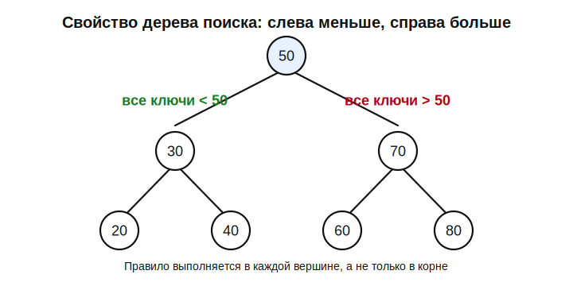

Поиск ключа в BST:

1. Начинаем с корня.
2. Если ключ равен ключу текущей вершины, элемент найден.
3. Если ключ меньше, идем в левое поддерево.
4. Если ключ больше, идем в правое поддерево.
5. Если дошли до пустой ссылки, ключа в дереве нет.

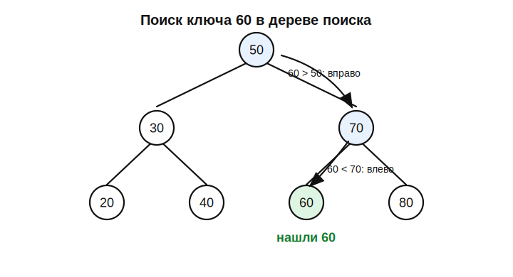

Вставка ключа в BST:

1. Идем от корня так же, как при поиске.
2. На каждом шаге сравниваем новый ключ с текущей вершиной.
3. Если ключ меньше, спускаемся влево; если больше, вправо.
4. Когда нашли пустую ссылку, создаем там новую вершину.
5. Свойство BST сохраняется, потому что место выбрано по сравнениям.

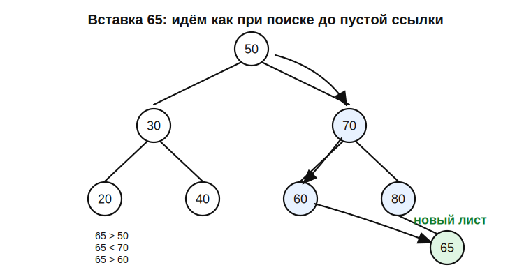

Удаление ключа из BST:

1. Сначала находим вершину с нужным ключом.
2. Если детей нет, просто удаляем вершину.
3. Если есть один ребенок, заменяем вершину этим ребенком.
4. Если детей два, берем следующий ключ по порядку: минимум из правого поддерева, или предыдущий ключ: максимум из левого поддерева.
5. Переносим этот ключ на место удаляемого и удаляем старую вершину с перенесенным ключом.

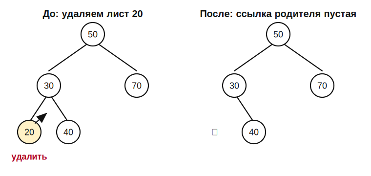

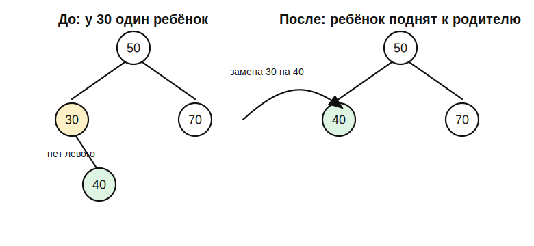

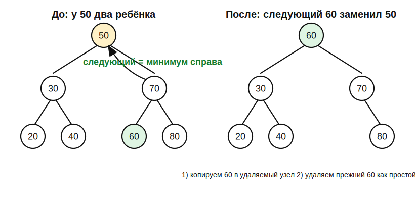

Поиск ключей в диапазоне $[l, r]$:

1. Если текущая вершина пустая, заканчиваем обход этой ветки.
2. Если текущий ключ больше $l$, проверяем левое поддерево.
3. Если текущий ключ попал в диапазон, добавляем его в ответ.
4. Если текущий ключ меньше $r$, проверяем правое поддерево.

В сбалансированном дереве сложность диапазонного запроса `O(log n + k)`, где `k` - число найденных элементов; в худшем случае для обычного BST - `O(n)`.

Обходы отличаются порядком посещения вершины: префиксный - вершина, левое, правое; инфиксный - левое, вершина, правое; постфиксный - левое, правое, вершина. Инфиксный обход BST выводит ключи в отсортированном порядке. Поиск, вставка и удаление работают за `O(h)`, где `h` - высота дерева: `O(log n)` в сбалансированном случае и `O(n)` при вырождении в список.

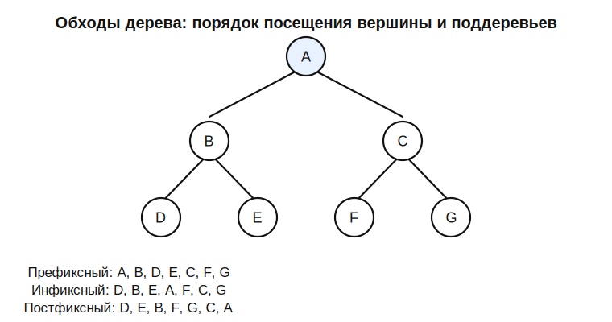

### 8. Ассоциативные контейнеры. АВЛ-дерево. Балансировка АВЛ-дерева при вставке элемента по ключу, при удалении элемента по ключу.

АВЛ-дерево - это самобалансирующееся BST. Для каждой вершины высоты левого и правого поддерева отличаются не больше чем на 1. Благодаря этому высота дерева остается `O(log n)`, а поиск, вставка и удаление работают за `O(log n)`.

В вершинах обычно хранят высоту или баланс-фактор. Баланс-фактор - это разность высот левого и правого поддерева. Если после операции он стал равен `2` или `-2`, нужна балансировка. Поворот меняет несколько ссылок, сохраняет порядок BST и уменьшает высоту проблемного поддерева.

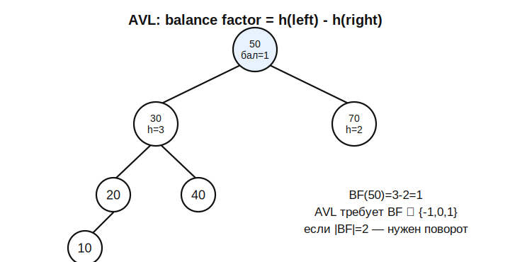

Малый левый поворот делает правого ребенка корнем поддерева, а малый правый поворот симметрично поднимает левого ребенка.

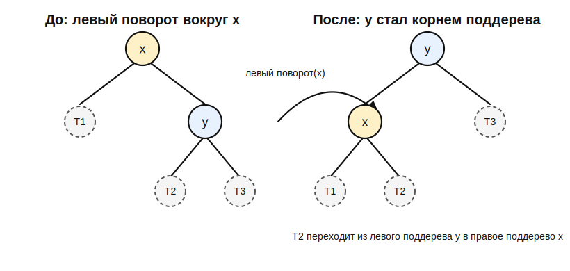

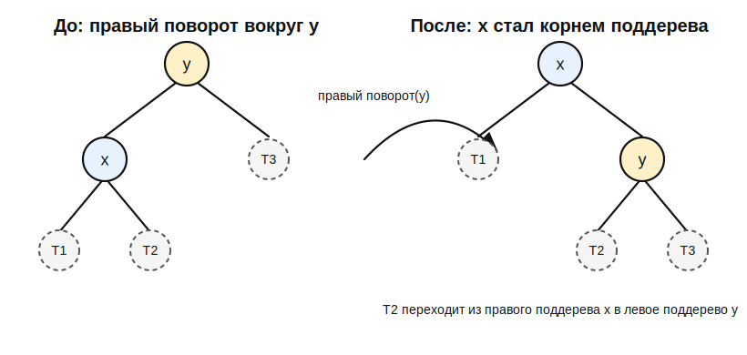

Вставка в AVL-дерево:

1. Добавляем ключ как в обычное BST.
2. На пути обратно к корню пересчитываем высоты.
3. Для каждой вершины проверяем баланс-фактор.
4. Если баланс стал `2` или `-2`, выбираем нужный случай и делаем поворот.

Случаи балансировки при вставке:

- `LL`: тяжелый путь идет в левое поддерево левого ребенка, нужен правый поворот;
- `RR`: тяжелый путь идет в правое поддерево правого ребенка, нужен левый поворот;
- `LR`: сначала левый поворот у левого ребенка, затем правый поворот;
- `RL`: сначала правый поворот у правого ребенка, затем левый поворот.

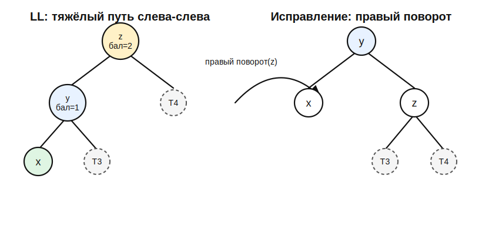

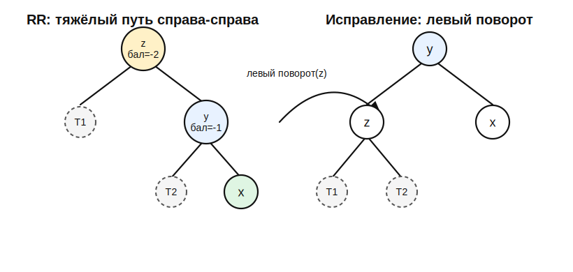

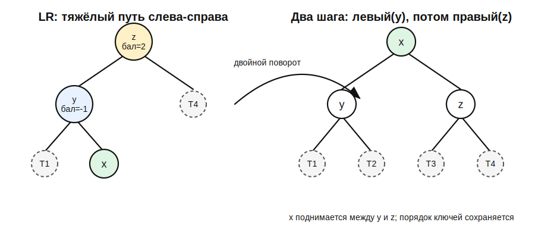

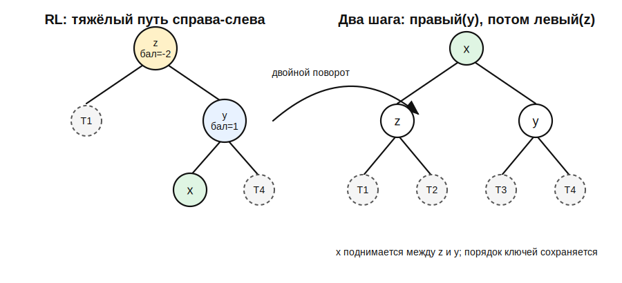

Удаление из AVL-дерева:

1. Удаляем ключ как в обычном BST.
2. Поднимаемся от места удаления к корню.
3. Пересчитываем высоты вершин.
4. Если у вершины нарушен баланс, применяем один из случаев `LL`, `RR`, `LR`, `RL`.
5. Продолжаем подниматься выше, потому что после удаления дисбаланс может появиться несколько раз.

Каждый поворот стоит `O(1)`, а весь путь имеет длину `O(log n)`. Память дерева - `O(n)`.

### 9. Ассоциативные контейнеры. Красно-черное дерево. Балансировка красно-черного дерева при вставке элемента по ключу, при удалении элемента по ключу.

Красно-черное дерево - это самобалансирующееся BST, где каждая вершина красная или черная. Баланс здесь мягче, чем в АВЛ-дереве, но высота все равно остается `O(log n)`. Поэтому поиск, вставка и удаление работают за `O(log n)`.

Основные свойства:

- каждый узел либо красный, либо черный;
- корень черный;
- пустые листья считаются черными;
- красная вершина не имеет красного родителя;
- на всех путях от вершины до пустых листьев одинаковое число черных вершин.

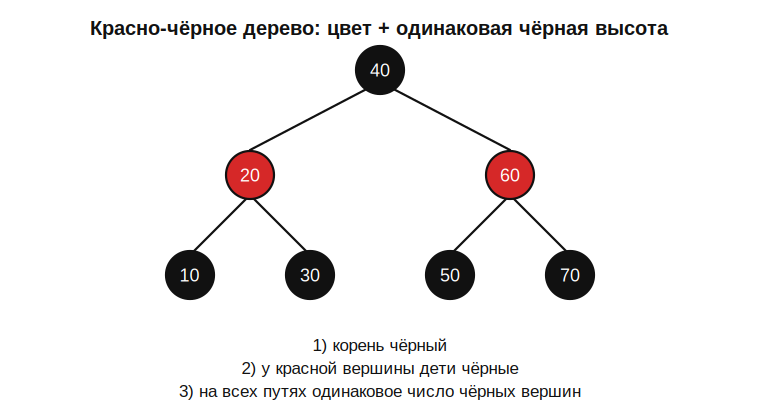

Поиск в красно-черном дереве такой же, как в BST: сравниваем ключ с текущей вершиной и идем влево или вправо. Цвета при поиске не используются.

Вставка в красно-черное дерево:

1. Вставляем ключ как в обычное BST.
2. Новую вершину красим в красный цвет.
3. Если родитель черный, все свойства сохранены.

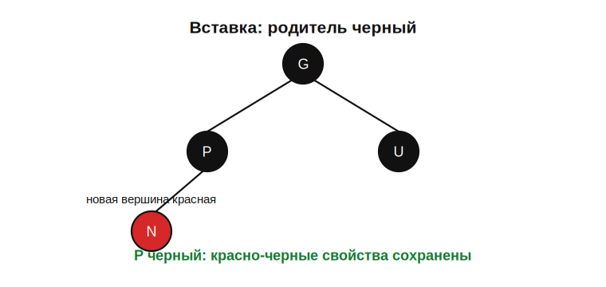

4. Если родитель красный, смотрим на дядю новой вершины.
5. Если дядя красный, родителя и дядю красим в черный, деда - в красный, затем продолжаем проверку от деда.

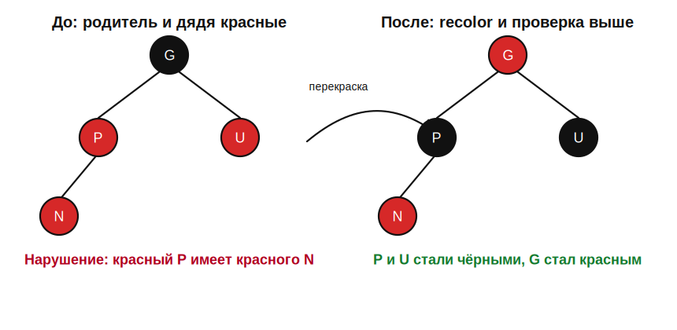

6. Если дядя черный, делаем поворот и перекраску вокруг деда.
7. Если форма "ломаная", сначала делаем малый поворот, чтобы получить прямую форму, затем основной поворот.
8. В конце корень снова красим в черный.

Прямые случаи с черным дядей:

- `LL`: новый узел в левом поддереве левого родителя, нужен правый поворот вокруг деда;
- `RR`: новый узел в правом поддереве правого родителя, нужен левый поворот вокруг деда.

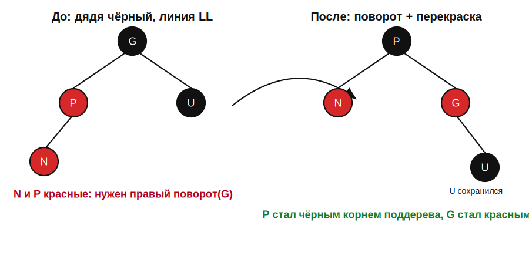

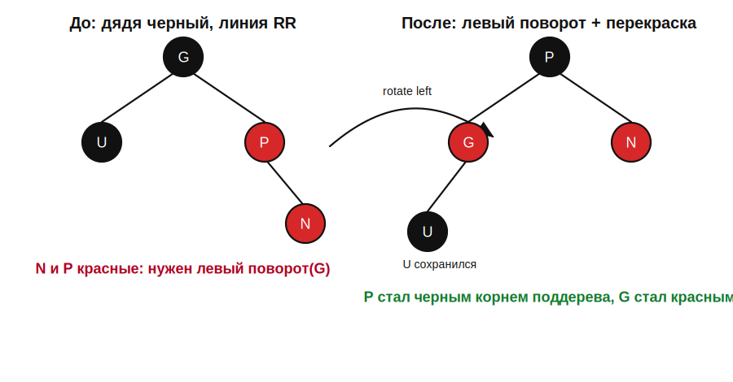

Ломаные случаи с черным дядей:

- `LR`: сначала левый поворот у родителя, затем правый поворот у деда;
- `RL`: сначала правый поворот у родителя, затем левый поворот у деда.

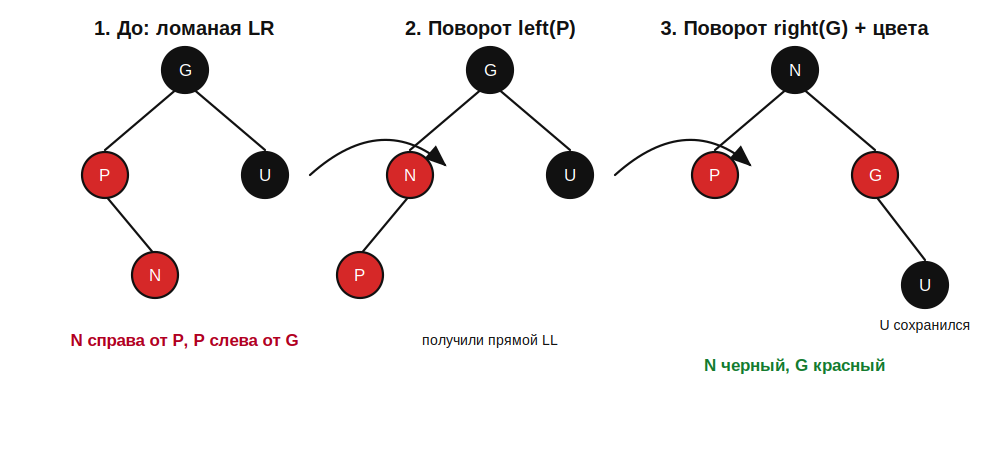

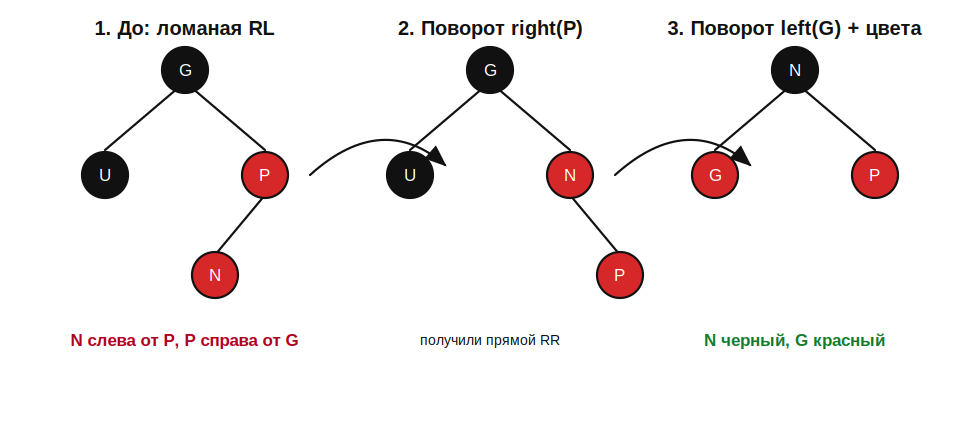

Удаление из красно-черного дерева:

1. Сначала удаляем вершину по правилам BST.
2. Если у вершины два ребенка, заменяем ее следующим ключом по порядку и фактически удаляем заменяющую вершину.
3. Если фактически удалена красная вершина, черная высота не меняется.
4. Если удалена черная вершина, появляется "двойная чернота", то есть нехватка черной вершины на части путей.
5. Смотрим на брата проблемной вершины и цвета его детей.
6. В зависимости от случая делаем перекраску, один поворот или два поворота.
7. После исправления должны снова выполняться черная высота и запрет красного родителя у красной вершины.

Простые случаи удаления:

- удалили красную вершину: ничего исправлять не нужно;
- удалили черную вершину с красным ребенком: ребенок занимает ее место и красится в черный.

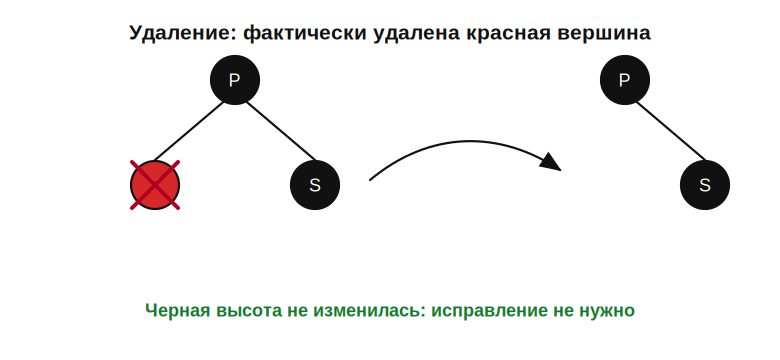

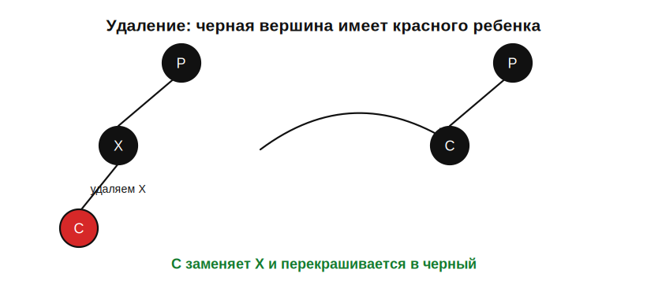

Случаи исправления "двойной черноты" показаны для ситуации, где проблемная вершина слева от родителя; зеркальные случаи выполняются симметрично.

- брат красный: меняем цвета брата и родителя, делаем поворот вокруг родителя;
- брат черный, оба ребенка брата черные: красим брата в красный, проблема поднимается к родителю;
- брат черный, ближний ребенок красный, дальний черный: поворот у брата переводит ситуацию к следующему случаю;
- брат черный, дальний ребенок красный: поворот вокруг родителя и перекраска завершают исправление.

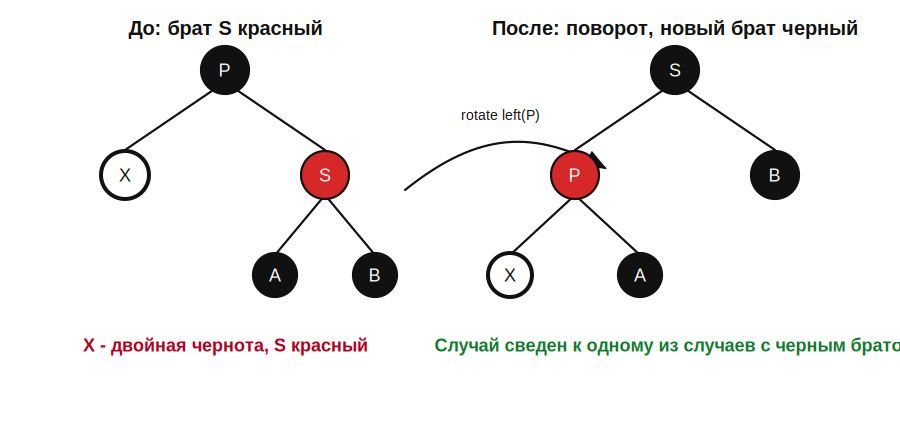

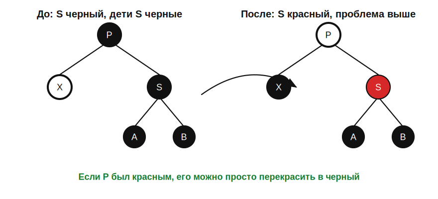

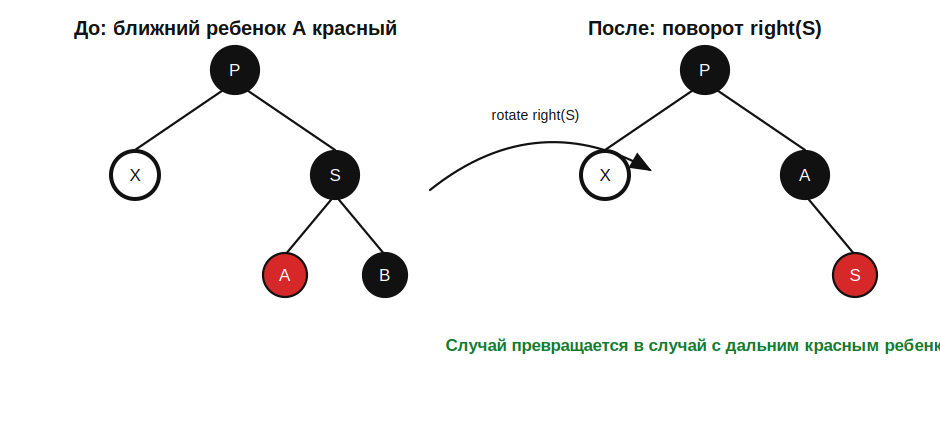

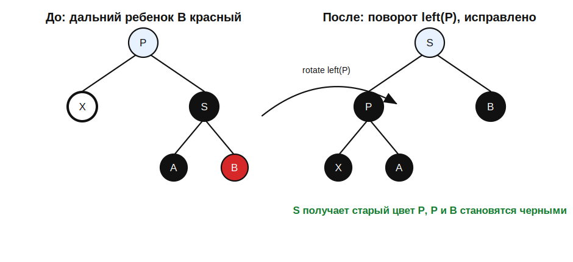

Красно-черное дерево часто используют в стандартных контейнерах: оно дает гарантированное `O(log n)` и обычно требует меньше строгих перестроек, чем АВЛ. Дополнительная память - цвет вершины и ссылки, всего `O(n)`.

### 10. Ассоциативные контейнеры. Splay-дерево. Балансировка splay-дерева при вставке элемента по ключу, при удалении элемента по ключу, при поиске элемента по ключу.

Splay-дерево - это самонастраивающееся BST. Оно не хранит высоты или цвета. После обращения к вершине выполняется операция `splay`: выбранная вершина поднимается в корень поворотами. Часто используемые ключи постепенно оказываются ближе к корню.

Основные случаи `splay`:

- `zig`: вершина - ребенок корня, нужен один поворот;
- `zig-zig`: вершина и родитель оба левые дети или оба правые дети, нужны два поворота в одну сторону;
- `zig-zag`: вершина и родитель лежат в разных направлениях, нужны два поворота в разные стороны.

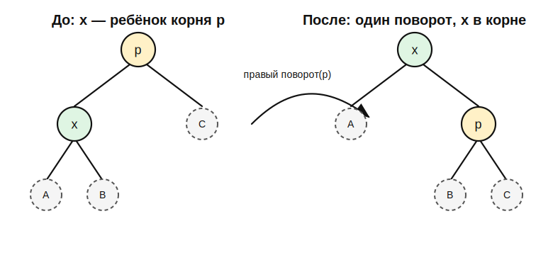

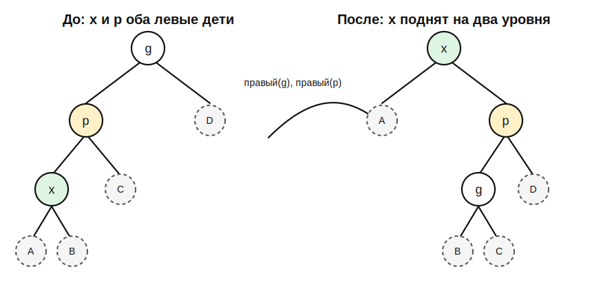

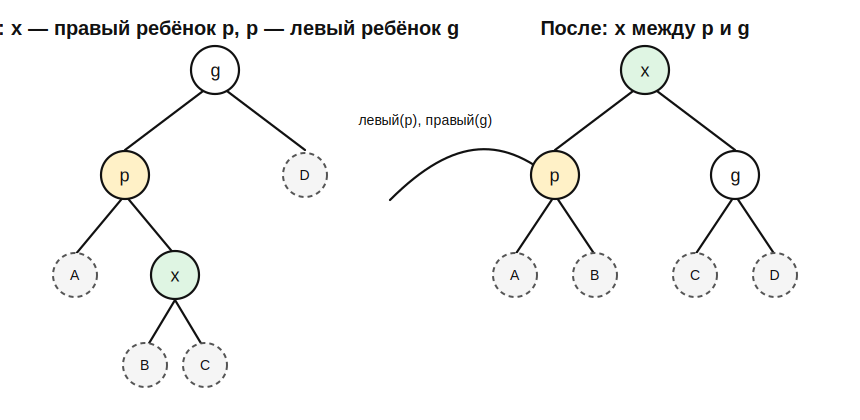

Поиск в splay-дереве:

1. Ищем ключ как в обычном BST.
2. Если ключ найден, выполняем `splay` для найденной вершины.
3. Если ключ не найден, обычно выполняем `splay` для последней посещенной вершины.
4. После этого недавно использованная область дерева оказывается ближе к корню.

Вставка в splay-дерево:

1. Вставляем новый ключ как в обычное BST.
2. Выполняем `splay` для новой вершины.
3. Новая вершина становится корнем.

Другой вариант: сначала найти место вставки, поднять ближайшую вершину в корень, затем создать новый корень и подвесить к нему подходящие левое и правое поддеревья.

Удаление из splay-дерева:

1. Ищем ключ и выполняем `splay`, чтобы нужная вершина стала корнем.
2. Если ключ не найден, удалять нечего.
3. Если ключ найден, удаляем корень.
4. Остаются левое и правое поддеревья.
5. Берем максимум левого поддерева и поднимаем его в корень левого поддерева.
6. Присоединяем правое поддерево как правого ребенка нового корня.

Одна операция в худшем случае может стоить `O(n)`, но амортизированная сложность поиска, вставки и удаления равна `O(log n)`. Память - `O(n)`.

### 11. Ассоциативные контейнеры. Декартово дерево. Балансировка декартового дерева при вставке элемента по ключу, при удалении элемента по ключу, при поиске элемента по ключу.

Декартово дерево, или treap, совмещает BST по ключам и кучу по приоритетам. У вершины есть ключ и приоритет. По ключам: слева меньше, справа больше. По приоритетам: приоритет родителя лучше приоритетов детей. Если приоритеты случайные, дерево в среднем сбалансировано.

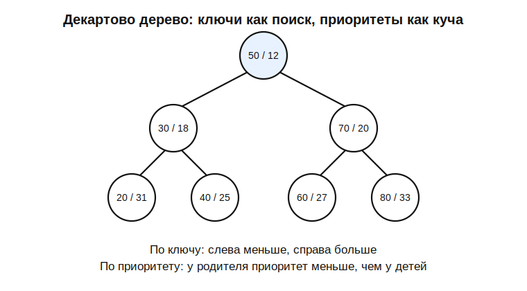

Поиск в treap:

1. Начинаем с корня.
2. Сравниваем искомый ключ с ключом текущей вершины.
3. Если ключ меньше, идем влево; если больше, идем вправо.
4. Приоритеты при поиске не используются.

Сложность равна высоте дерева: в среднем `O(log n)`, в худшем случае `O(n)`.

Вставка через повороты:

1. Вставляем новую вершину как лист BST.
2. Сравниваем ее приоритет с приоритетом родителя.
3. Пока свойство кучи нарушено, поднимаем вершину поворотами.
4. Повороты сохраняют порядок ключей BST.

Вставка через `split` и `merge`:

1. Делаем `split` по новому ключу.
2. Получаем левое дерево с меньшими ключами и правое дерево с большими ключами.
3. Создаем новую вершину.
4. Соединяем левую часть, новую вершину и правую часть через `merge` с учетом приоритетов.

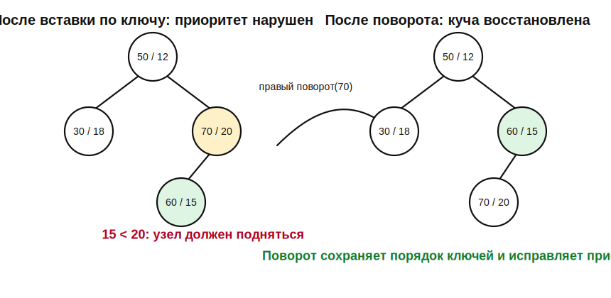

Удаление через `merge`:

1. Находим вершину с нужным ключом.
2. Удаляем эту вершину.
3. Вместо нее соединяем ее левое и правое поддеревья.
4. В `merge` корнем становится вершина с лучшим приоритетом.
5. Оставшаяся часть соединяется рекурсивно.
6. В итоге сохраняются и порядок BST, и свойство кучи.

Treap прост в балансировке: не нужны высоты, цвета и много случаев. Память - `O(n)`. Поиск, вставка, удаление, `split` и `merge` в среднем работают за `O(log n)`.

### 12. Арифметические алгоритмы. Элементарные операции над длинными целыми числами. Дополнительный код числа. Организация хранения длинного вещественного числа в памяти компьютера.

Длинное целое число хранят как знак и массив разрядов в основании $B$:
$$A = s \cdot \sum_{i=0}^{n-1} a_i B^i,$$
где $s \in \{1, -1\}$, $0 \le a_i < B$, а $a_0$ - младший разряд. После операций число нормализуют: убирают лишние старшие нули, а ноль хранят без отрицательного знака.

Сравнение сначала смотрит на знак, затем на длину массива разрядов, затем идет от старшего разряда к младшему. Сложность сравнения - `O(n)`. Сложение выполняется от младших разрядов к старшим:
$$t_i = a_i + b_i + c_i,\quad r_i = t_i \bmod B,\quad c_{i+1} = \lfloor t_i / B \rfloor.$$
Вычитание использует заем. Если $t_i = a_i - b_i - \mathrm{borrow}_i < 0$, то $r_i = t_i + B$ и следующий заем равен 1. Сложение и вычитание имеют сложность `O(n)`.

Умножение в столбик - это свертка разрядов:
$$d_k = \sum_{i+j=k} a_i b_j.$$
После этого каждый $d_k$ нормализуют по основанию $B$ с переносом. Для чисел длины $n$ и $m$ сложность `O(nm)`, для равных длин - `O(n^2)`. Деление в столбик строит частное от старших разрядов к младшим: к текущему остатку приписывается следующий разряд, выбирается максимальная цифра $q_i$, для которой $q_iD \le R$, затем $q_iD$ вычитается из остатка. Классическое деление близких длин имеет оценку `O(n^2)`.

Дополнительный код фиксированной ширины $w$ хранит числа по модулю $2^w$. Для неотрицательного $x$ код равен $x$. Для отрицательного $-x$ код равен $2^w - x$: можно инвертировать биты $x$ и прибавить 1. Если беззнаковое слово $u$ имеет старший бит 1, его знаковое значение равно $u - 2^w$.

Длинное вещественное число можно хранить как
$$x = (-1)^s \cdot M \cdot B^e,$$
где $s$ - знак, $M$ - мантисса, $B$ - основание, $e$ - порядок. Мантисса хранит только $p$ значащих разрядов, поэтому после операций число нормализуют и округляют. Чем больше $p$, тем выше точность, но тем больше время и память.

### 13. Алгоритмы с многочленами от одной переменной. Арифметика многократной точности. Сложение и вычитание целых чисел. Умножение и деление целых чисел. Тривиальные алгоритмы.

Многочлен от одной переменной имеет вид
$$A(x) = \sum_{i=0}^{d} a_i x^i.$$
Степень ненулевого многочлена - максимальный номер ненулевого коэффициента. Длинное число в основании $B$ можно рассматривать как значение такого многочлена при $x = B$: $A(B) = \sum a_i B^i$. Поэтому алгоритмы для многочленов и длинных чисел похожи, но у чисел после операций нужны переносы.

Сложение и вычитание выполняются покоэффициентно:
$$(A + C)_k = a_k + c_k,\quad (A - C)_k = a_k - c_k.$$
Если отсутствующие коэффициенты считать нулями, сложность равна `O(n)`. Для длинных целых это та же работа по разрядам, но с переносами и заемами по основанию $B$.

Тривиальное умножение многочленов - это свертка:
$$(AC)_k = \sum_{i+j=k} a_i c_j.$$
Для многочленов с $n$ и $m$ коэффициентами сложность `O(nm)`, а результат имеет не больше $n + m - 1$ коэффициентов. У длинных чисел сначала получается такая же свертка разрядов, затем выполняется нормализация переносами.

Деление длинных чисел в столбик строит частное по старшим разрядам и поддерживает инвариант $A = QD + R$, где $0 \le R < D$ после завершения. Для близких длин классическая оценка - `O(n^2)`. Деление многочленов с остатком работает над полем коэффициентов или когда старший коэффициент делителя обратим. Пока $\deg R \ge \deg D$, берут
$$\mathrm{term} = \frac{\mathrm{lc}(R)}{\mathrm{lc}(D)} x^{\deg R - \deg D},$$
затем обновляют $Q := Q + \mathrm{term}$ и $R := R - \mathrm{term}D$.

### 14. Арифметические операции над элементами множеств различной природы. Понятие группы, коммутативной группы. Нейтральный элемент группы. Обратный элемент группы. Понятие кольца. Аксиомы кольца. Кольца вычетов по модулю $n$. Обратимые элементы кольца вычетов. Понятие поля. Поле вычетов по модулю $n$.

Арифметику над разными объектами описывают через алгебраические структуры: множество и операции на нем. Это позволяет применять одни и те же идеи к числам, остаткам, многочленам и матрицам.

Группа - это множество $G$ с операцией $*$, где выполнены замкнутость, ассоциативность, есть нейтральный элемент $e$ и для каждого $a$ есть обратный элемент $a^{-1}$. Нейтральный элемент не меняет элемент: $e*a = a*e = a$. Обратный дает нейтральный: $a*a^{-1} = a^{-1}*a = e$. Если еще $a*b = b*a$, группа называется коммутативной, или абелевой.

Кольцо - это множество $R$ с операциями $+$ и $\cdot$. По сложению $(R,+)$ является абелевой группой. Умножение ассоциативно, а сложение и умножение связаны дистрибутивностью:
$$a(b+c)=ab+ac,\quad (a+b)c=ac+bc.$$
Часто рассматривают кольца с единицей $1$ - нейтральным элементом по умножению.

Кольцо вычетов по модулю $n$ обозначают $\mathbb{Z}_n$ или $\mathbb{Z}/n\mathbb{Z}$. Его элементы - остатки $[0], [1], \ldots, [n-1]$, а операции задаются по модулю:
$$[a]+[b]=[a+b],\quad [a][b]=[ab].$$

Элемент $[a]$ обратим по умножению, если существует $[b]$, такое что $ab \equiv 1 \pmod n$. Критерий: $[a]$ обратим тогда и только тогда, когда $\gcd(a,n)=1$. Поле - это кольцо с единицей, где каждый ненулевой элемент обратим по умножению. $\mathbb{Z}_n$ является полем ровно тогда, когда $n$ - простое число.

### 15. Многочлены от одной переменной. Кольца многочленов.

Многочлен от одной переменной над кольцом $R$ - это формальная конечная сумма
$$A(x)=a_0+a_1x+\ldots+a_dx^d=\sum_{i=0}^{d} a_i x^i,$$
где $a_i \in R$. Многочлен задается коэффициентами, а не только значениями как функция. Степень ненулевого многочлена - номер старшего ненулевого коэффициента.

Операции задаются по коэффициентам:
$$(A+C)_k=a_k+c_k,\quad (A-C)_k=a_k-c_k,$$
а произведение задается сверткой:
$$(AC)_k=\sum_{i+j=k} a_i c_j.$$

Множество всех многочленов над $R$ обозначают $R[x]$. Если $R$ - кольцо, то $R[x]$ тоже кольцо: нулевой элемент - нулевой многочлен, сложение и умножение задаются формулами выше, а дистрибутивность наследуется от $R$. Если в $R$ есть единица, то единицей в $R[x]$ является постоянный многочлен $1$.

Деление многочленов с остатком гарантированно работает над полем коэффициентов. Для ненулевого $D$ существуют $Q$ и $R$, такие что $A = QD + R$, причем $R = 0$ или $\deg R < \deg D$. Над общим кольцом нужно, чтобы старший коэффициент делителя был обратим, например если делитель монический.

### 16. Классический алгоритм умножения многочленов (умножение в "столбик"), анализ его сложности. Сравнение с алгоритмом умножения целых чисел.

Пусть
$$A(x)=\sum_{i=0}^{n-1}a_ix^i,\quad C(x)=\sum_{j=0}^{m-1}c_jx^j.$$
При умножении используется правило $x^i \cdot x^j = x^{i+j}$, поэтому коэффициент произведения равен
$$p_k=\sum_{i+j=k}a_ic_j.$$
То есть для каждой пары коэффициентов $a_i$ и $c_j$ их произведение добавляется в $p_{i+j}$.

Всего есть $nm$ пар коэффициентов, поэтому время работы равно `O(nm)`, а при $n=m$ - `O(n^2)`. Результат имеет не больше $n+m-1$ коэффициентов, память под результат - `O(n+m)`.

Длинные целые умножаются почти так же. Если
$$A=\sum a_i\beta^i,\quad C=\sum c_j\beta^j,$$
то произведение разрядов дает ту же свертку. Отличие в том, что у числа каждый разряд должен быть меньше основания $\beta$, поэтому после свертки выполняются переносы: $p_k \bmod \beta$ остается в текущем разряде, а $\lfloor p_k/\beta \rfloor$ переносится дальше.

### 17. Алгоритм умножения Карацубы, анализ его сложности.

Карацуба ускоряет умножение, заменяя четыре произведения половин на три. Разобьем числа или многочлены на младшую и старшую части:
$$A=A_0+A_1q,\quad C=C_0+C_1q,$$
где для длинных чисел $q=\beta^m$, а для многочленов $q=x^m$.

Обычное раскрытие:
$$AC=A_0C_0+(A_0C_1+A_1C_0)q+A_1C_1q^2.$$
Карацуба считает:
$$z_0=A_0C_0,\quad z_2=A_1C_1,\quad z_s=(A_0+A_1)(C_0+C_1).$$
Средний блок находится без двух отдельных умножений:
$$z_1=z_s-z_0-z_2=A_0C_1+A_1C_0.$$

Итоговое произведение:
$$AC=z_0+z_1q+z_2q^2.$$
У чисел умножение на $q$ - это сдвиг на $m$ разрядов, у многочленов - сдвиг степеней. Сложение, вычитание и сдвиги стоят линейно.

Рекуррентная оценка:
$$T(n)=3T(n/2)+O(n).$$
По мастер-теореме:
$$T(n)=O(n^{\log_2 3}) \approx O(n^{1.585}).$$
На маленьких размерах используют обычное умножение в столбик. Если длины не равны, части дополняют нулями или делят почти поровну.

### 18. Примитивные корни из единицы и их свойства. Дискретное преобразование Фурье и его свойства. Обратное дискретное преобразование Фурье.

Корень из единицы степени $n$ - это элемент $w$, для которого $w^n=1$. Он примитивный, если $w^k \ne 1$ для всех $1 \le k < n$. В комплексных числах обычно берут
$$w_n=\exp(2\pi i/n).$$
Его степени $1,w_n,w_n^2,\ldots,w_n^{n-1}$ дают все $n$ различных корней.

Важное свойство - ортогональность:
$$\sum_{j=0}^{n-1} w_n^{j(k-l)}=
\begin{cases}
n, & k=l,\\
0, & k\ne l.
\end{cases}$$
Именно оно позволяет восстановить коэффициенты обратным преобразованием.

Пусть многочлен степени меньше $n$ задан коэффициентами
$$A(x)=\sum_{j=0}^{n-1}a_jx^j.$$
DFT переводит коэффициенты в значения многочлена в точках $1,w,w^2,\ldots,w^{n-1}$:
$$A_k=\sum_{j=0}^{n-1}a_jw^{jk},\quad k=0,\ldots,n-1.$$
То есть $A_k=A(w^k)$.

Обратное DFT возвращает коэффициенты:
$$a_j=\frac{1}{n}\sum_{k=0}^{n-1}A_kw^{-jk}.$$
Деление на $n$ появляется из ортогональности степеней. Если DFT выполняется не над комплексными числами, нужно, чтобы существовал примитивный корень и чтобы $n$ было обратимо.

DFT полезно для умножения многочленов: свертка коэффициентов превращается в покоординатное умножение значений. Схема такая: посчитать DFT двух многочленов, перемножить значения, применить обратное DFT. Прямое вычисление DFT по формуле требует `O(n^2)` операций.

### 19. Алгоритм быстрого преобразования Фурье. Алгоритм быстрого умножения многочленов на основе быстрого преобразования Фурье. Алгоритм Шенхаге - Штрассена.

FFT вычисляет DFT за `O(n log n)` вместо `O(n^2)`. Обычно берут $n=2^t$, а если коэффициентов меньше, дополняют их нулями. Многочлен раскладывают на четные и нечетные коэффициенты:
$$A(x)=A_0(x^2)+xA_1(x^2),$$
где $A_0$ содержит $a_0,a_2,\ldots$, а $A_1$ содержит $a_1,a_3,\ldots$.

Если $w_n$ - примитивный корень степени $n$, то $w_n^2$ является корнем степени $n/2$. Поэтому DFT сводится к двум DFT размера $n/2$. После рекурсивного вычисления
$$u_k=A_0(w_n^{2k}),\quad v_k=A_1(w_n^{2k})$$
значения объединяются формулами:
$$y_k=u_k+w_n^kv_k,$$
$$y_{k+n/2}=u_k-w_n^kv_k.$$

На каждом уровне есть две задачи размера $n/2$ и линейное объединение:
$$T(n)=2T(n/2)+O(n)=O(n\log n).$$
Обратное FFT использует обратный корень $w_n^{-1}$, а в конце все коэффициенты делятся на $n$.

Для умножения многочленов выбирают $N \ge n+m-1$, дополняют коэффициенты нулями до $N$, считают `FFT(A)` и `FFT(C)`, перемножают значения покоординатно и применяют обратное FFT:
$$AC=\mathrm{IDFT}(\mathrm{DFT}(A)\cdot\mathrm{DFT}(C)).$$
Сложность умножения - `O(N log N)`.

Для длинных целых число рассматривают как многочлен от основания $B$, быстро перемножают разрядные многочлены, затем выполняют переносы. При комплексной FFT нужно учитывать ошибки округления. Алгоритм Шенхаге - Штрассена использует FFT-подобную свертку в точной модульной арифметике, часто по модулям вида $2^N+1$, а затем собирает результат с переносами. Его сложность для $n$ бит: `O(n log n log log n)`.
